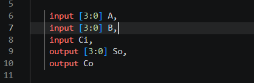
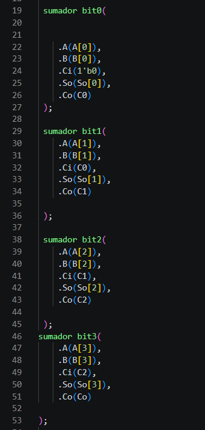
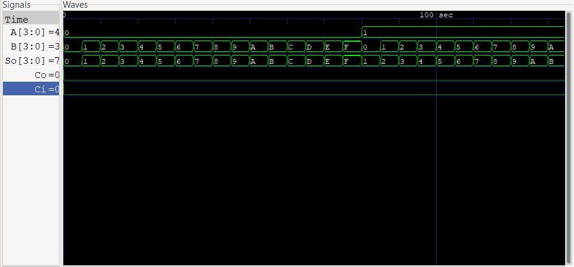

# Técnicas Digitales G3 E9

# SUMADOR DE 4BITS 

# Integrantes
* [Jefferson Stiven Quiñones Yate](https://github.com/jeffersonstquinonesya-bit) 
* [Oscar David Vargas ](https://github.com/oscardavargas) 

## Índice

- [1. Introducción](#1-introducción)
- [2. Objetivos](#2-objetivos)
- [3. Marco teórico](#3-marco-teórico)
- [4. Desarrollo](#4-desarrollo)
- [6. Conclusiones](#6-conclusiones)

## 1. Introducción

En el presente proyecto se diseña e implementa un sumador de 4 bits (sumadorfour), construido a partir de la interconexión en cascada de cuatro sumadores completos de 1 bit (sumador). Cada sumador completo procesa un bit de las entradas A y B junto con el acarreo proveniente de la etapa anterior (Ci), generando como salida el bit de suma (So) y el acarreo de salida (Co), el cual se propaga como entrada de acarreo hacia la siguiente etapa. Esta estructura modular permite escalar el diseño de 1 bit a 4 bits reutilizando el mismo bloque funcional.

## 2. Objetivos

### 2.1 Objetivo general
Diseñar, implementar y verificar mediante simulación un sumador de 4 bits en Verilog, construido a partir de sumadores completos de 1 bit interconectados en cascada.

## 3. Marco teórico.

### 3.1 Sumador.
Circuito combinacional que suma dos bits (A, B) y un acarreo de entrada (Ci), generando una suma (So) y un acarreo de salida (Co)

### 3.2 Sumador de acarreo.
Interconexión en cascada de sumadores completos, donde el Co (acarreo de salida) de cada etapa alimenta el Ci (acarreo de entrada ) de la siguiente. Simple de implementar, aunque su tiempo de propagación crece con el número de bits.

### 3.3 Testbench
Módulo de verificación que instancia el diseño y aplica estímulos controlados a sus entradas para observar el comportamiento de las salidas, sin necesidad de hardware físico.

## 4. Desarrollo

### 4.1 Módulo `sumador` (sumador completo de 1 bit)

Este módulo implementa la lógica combinacional del sumador completo mediante compuertas primitivas.

### 4.2 Módulo `sumadorfour` (sumador de 4 bits)

Dos entradas de 4 bits cada una (buses), representadas como vectores [3:0] → bit 3 (más significativo) al bit 0 (menos significativo). Son los dos números que se van a sumar.

Se instancian cuatro sumadores completos, propagando el acarreo (Co → Ci) de una etapa a la siguiente. El primer bit recibe un acarreo de entrada fijo en `0`.

### 4.3 Banco de pruebas `sumadorfour_TB`

El testbench recorre todas las combinaciones de `A` (0–15), `B` (0–15) y `Ci` (0–1), aplicando cada combinación durante 5 unidades de tiempo, lo que permite observar el resultado en el simulador de formas de onda.

### Bucle for
Declara tres variables de tipo integer (enteros de 32 bits, con signo) que se usarán como contadores de los bucles for. En Verilog no se pueden declarar variables dentro del for como en C, así que se declaran antes.

- Bloque initial: se ejecuta una sola vez, comenzando en el tiempo de simulación 0.

- Bucle más externo. k recorre los valores 0 y 1 → representa las dos posibilidades del acarreo de entrada (Ci).
- Bucle intermedio. i recorre 0 a 15 → todas las combinaciones posibles del valor de A (4 bits = 2⁴ = 16 valores).
- Bucle más interno. j recorre 0 a 15 → todas las combinaciones posibles del valor de B.
- En cada iteración se asignan los valores actuales de los contadores a las señales del testbench que alimentan al sumadorfour. Como A_TB y B_TB son reg [3:0], el entero i/j se trunca automáticamente a 4 bits.

    

Es decir, se prueban todos los valores posibles de A (0–15), B (0–15) y Ci (0 ó 1), cubriendo el espacio de entradas del sumador de 4 bits.

## 6. Conclusiones

1. Se diseñó exitosamente un sumador completo de 1 bit utilizando compuertas lógicas básicas (XOR, AND, OR).
2. La interconexión en cascada de cuatro sumadores completos permitió construir un sumador de 4 bits funcional, demostrando la utilidad del diseño jerárquico en Verilog.
3. El testbench desarrollado permitió validar de manera exhaustiva el comportamiento del circuito ante todas las combinaciones posibles de entrada.
