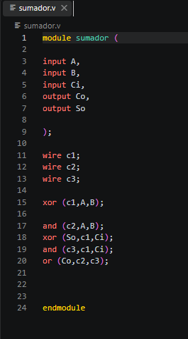
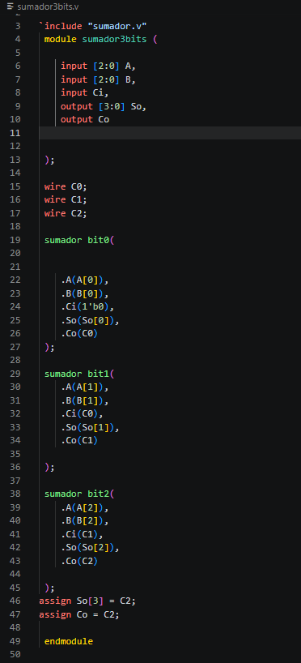
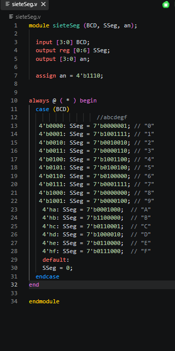
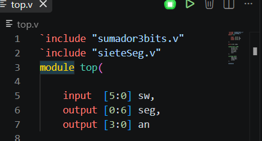

# Técnicas Digitales G3 E9


# SUMADOR DE 3BITS E IMPLEMENTACION 7 SEGMENTOS


# Integrantes
* [Jefferson Stiven Quiñones Yate](https://github.com/jeffersonstquinonesya-bit) 
* [Oscar David Vargas ](https://github.com/oscardavargas) 

## Índice


- [1. Introducción](#1-introducción)
- [2. Objetivos](#2-objetivos)
- [3. Marco teórico](#3-marco-teórico)
- [4. Desarrollo](#4-desarrollo)
- [6. Conclusiones](#6-conclusiones)


## 1. Introducción
En este proyecto se desarrolló un sumador de 3 bits utilizando el lenguaje de descripción de hardware Verilog. El sistema recibe dos números binarios de tres bits, realiza la operación de suma y presenta el resultado mediante un display de 7 segmentos.

La implementación se realizó de forma modular, empleando un sumador completo de 1 bit como bloque fundamental para la construcción del sumador de 3 bits. Posteriormente, se diseñó un decodificador que permite mostrar el resultado de la operación en un display de 7 segmentos.

## 2. Objetivos

### 2.1 Objetivo general
- Visualizar los numeros del 1 al 9 en el 7 segmentos, 10 al 15 en exadecimal.
- Diseñar e implementar un sumador de 3 bits utilizando Verilog y visualizar el resultado mediante un display de 7 segmentos


### 2.2 Objetivo especifico 
- visualizar numeros del al 15 en el 7 segmentos
- Implementar un sumador completo de 1 bit.
- Construir un sumador de 3 bits mediante la conexión de tres sumadores completos.
- Integrar todos los módulos en un sistema funcional.
-Verificar el correcto funcionamiento mediante pruebas y simulaciones.


## 3. Marco teórico.
### 3.1 Sumador.

Es un circuito lógico combinacional capaz de realizar la suma de tres bits de entrada de forma simultánea. 
Su función principal es sumar dos bits de datos junto con un bit de acarreo proveniente de una etapa anterior y generar como resultado un bit de suma y un bit de acarreo de salida.

### Tabla de la verdad 
La tabla de verdad muestra todas las combinaciones posibles para las entradas y sus respectivas salidas.

| A | B | Ci | So | Co |
| - | - | -- | -- | -- |
| 0 | 0 | 0  | 0  | 0  |
| 0 | 0 | 1  | 1  | 0  |
| 0 | 1 | 0  | 1  | 0  |
| 0 | 1 | 1  | 0  | 1  |
| 1 | 0 | 0  | 1  | 0  |
| 1 | 0 | 1  | 0  | 1  |
| 1 | 1 | 0  | 0  | 1  |
| 1 | 1 | 1  | 1  | 1  |

### Codigo



### 3.2 Sumador de 3bits

El sumador de 3 bits esta diseñado para realizar la suma de dos números binarios de tres bits cada uno. Su función es procesar ambos operandos y generar una salida de cuatro bits que represente el resultado de la operación.

El sumador de 3 bits esta utilizando tres módulos de sumador completo conectados en cascada. Esta técnica se conoce como sumador en serie con propagación de acarreo.

### Tabla de la verdad

| A  | B  | Resultado (bin) | Resultado (dec) |
| ------- | ------- | --------------- | --------------- |
| 000     | 000     | 0000            | 0               |
| 000     | 001     | 0001            | 1               |
| 001     | 001     | 0010            | 2               |
| 001     | 010     | 0011            | 3               |
| 010     | 010     | 0100            | 4               |
| 010     | 011     | 0101            | 5               |
| 011     | 011     | 0110            | 6               |
| 011     | 100     | 0111            | 7               |
| 100     | 100     | 1000            | 8               |
| 100     | 101     | 1001            | 9               |
| 101     | 101     | 1010            | 10              |
| 101     | 110     | 1011            | 11              |
| 110     | 110     | 1100            | 12              |
| 110     | 111     | 1101            | 13              |
| 111     | 111     | 1110            | 14              |


### Codigo


### 3.3 Siete segmento
El display de 7 segmentos es un dispositivo electrónico utilizado para representar números y algunos caracteres mediante la combinación de siete elementos luminosos independientes llamados segmentos.

El display de 7 segmentos se utiliza para mostrar el resultado de la suma realizada por el sumador de 3 bits.


###  Estructura del Display de 7 Segmentos

El display de 7 segmentos está formado por siete LEDs individuales identificados con las letras `a, b, c, d, e, f y g`. La combinación de estos segmentos permite representar números y algunos caracteres hexadecimales.


```text
        a
     ──────
  f │      │ b
    │  g   │
     ──────
  e │      │ c
    │      │
     ──────
        d
```


El resultado generado por el sumador de 3 bits se envía al módulo `sieteSeg.v`, el cual convierte la salida binaria de 4 bits en la combinación adecuada de segmentos para mostrar el valor correspondiente en el display.

### Codigo



#### 3.4. Modulo principal ( top.v )

Su función es interconectar todos los módulos desarrollados previamente para que trabajen como un único sistema.

Este módulo recibe los datos de entrada desde los interruptores de la FPGA, ejecuta la operación de suma mediante el módulo sumador3bits y envía el resultado al módulo sieteSeg, encargado de mostrar el valor en el display de 7 segmentos.



- `imput [5:0]sw,` La entrada sw corresponde a los 6 interruptores utilizados para ingresar los números a sumar.

- `output [0:6] seg; `Controla los segmentos del display.

- `output [3:0] an;`Selecciona el display que permanecerá activo.